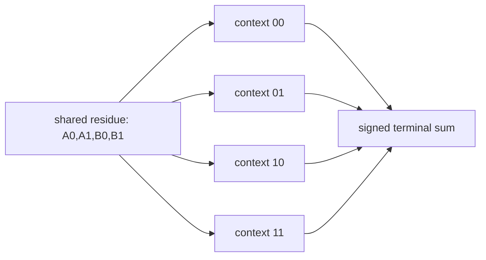

# Bell violation as failure of global interaction-net gluing

The CHSH bound has a direct interaction-net formulation. A deterministic
Bell-local model requires one shared continuation residue carrying four
counterfactual outputs: \(A_0,A_1,B_0,B_1\in\{-1,1\}\). Each of the four
measurement-context agents reads two wires from that same residue.



The terminal reduction is

\[
A_0B_0+A_0B_1+A_1B_0-A_1B_1
=
A_0(B_0+B_1)+A_1(B_0-B_1).
\]

Because \(B_0,B_1\) are signs, exactly one parenthesis is zero and the
other is \(\pm2\). Every globally glued deterministic net therefore reduces
to \(\pm2\); convex mixtures satisfy the CHSH bound.

The polarization singlet instead supplies four legal context-local redexes

\[
E(a,b)=-\cos 2(a-b).
\]

For \(a_0=0\), \(a_1=\pi/4\), \(b_0=\pi/8\), and \(b_1=-\pi/8\),
their signed terminal reduction has magnitude \(2\sqrt2\). Each context is
well typed, normalized, and compatible with no-signalling. What fails is the
existence of one residue containing simultaneous values for all four
incompatible settings.

The interaction-net Explanation is therefore not that a signal crosses
between the wings. It is that the four context-local reductions cannot be
globally glued through the counterfactual residue required by a Bell-local
network.

This is a fourth topology in the emerging grammar:

- open continuation path: three polarizers;
- closed return loop: Schur first jet;
- labelled terminal evaluator: 43/44 sign flip;
- locally consistent context cover without global gluing: Bell violation.

Verification:

```text
uv run --with sympy python research/aspect/checkers/check_bell_global_gluing_interaction_net.py
```
