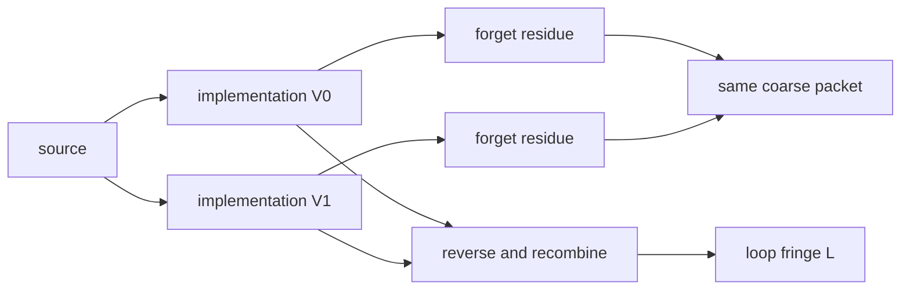

# Coarse-equal instruments as unequal interaction-net loops

Two instrument implementations can reduce to the same coarse channel while
remaining distinguishable as coherent constructor paths.

Let \(V_0\) and \(V_1\) be two implementations. Forgetting the implementation
residue gives the same observable channel:

\[
\operatorname{FORGET}\circ V_0
=
\operatorname{FORGET}\circ V_1.
\]

This equality is a quotient rewrite. It does not identify the original paths.
Coherent control constructs a different interaction net by joining one path
to the reverse of the other:

\[
V_0^\dagger V_1 \longrightarrow L.
\]

The loop observable \(L\) retains phase and environmental overlap erased by
the coarse rewrite.



The exact fixture has four reductions:

- identity path: \(L=1\);
- phase refinement: \(L=e^{i\pi/3}\);
- equivalent dilation: \(L=(4/5)e^{i\pi/3}\);
- dephased control: \(L=0\).

All four have the same coarse state and therefore the same inclusive Bell
packet. Dephasing destroys the loop observable without changing that packet.
The surprise is not hidden in the probabilities; it is discarded by the
forgetful reduction used to produce them.

This adds a fifth interaction-net topology: a pair of equal coarse shadows
with an unequal coherent comparison loop.

Verification:

```text
uv run --with sympy python research/aspect/checkers/check_coarse_equal_constructor_loop_interaction_net.py
```
