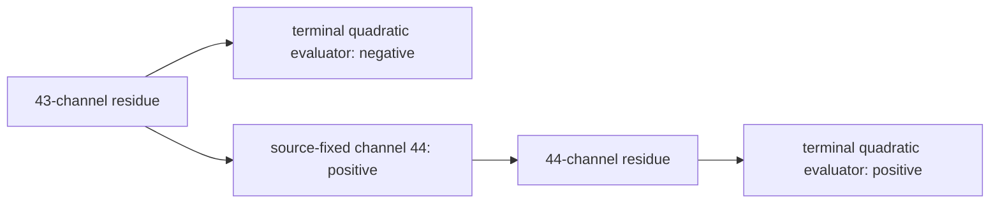

# The 43/44 sign flip as a labelled interaction net

The adjacent gamma-bank result exposes an expressivity boundary of bare
interaction nets. The topology identifies the new interaction, but topology
and local channel positivity alone do not determine the terminal sign.

The reduction has the form

\[
\operatorname{ENERGY}(e_{43})
\mathbin{\Join}
\operatorname{CHANNEL}(\delta_{44})
\longrightarrow
\operatorname{ENERGY}(e_{43}+\delta_{44}),
\qquad \delta_{44}>0.
\]

That rule does not imply a sign flip. The same net and the same positive
channel admit both reductions:

```text
ENERGY(-2) + CHANNEL(+3) -> ENERGY(+1)   flip
ENERGY(-4) + CHANNEL(+3) -> ENERGY(-1)   no flip
```

Therefore neither the existence of the forty-fourth channel, its positivity,
nor the parity of the channel count explains the observed reversal.

The completed labelled net needs one more constructor: the source-derived
terminal quadratic evaluator. The existing certified intervals label its two
adjacent reductions:

\[
e_{43}\in[-6.2,-5.4]\times10^{-5},
\qquad
e_{44}\in[2.0,3.4]\times10^{-6}.
\]

With those labels, the terminal rewrite is deterministic: level 43 is negative
and level 44 is positive. The interaction-net Explanation is then precise:
the forty-fourth channel is the only new local interaction through which the
repair can enter, while the global boundary evaluator certifies that the
accumulated residue actually crosses zero.



This differs from both earlier examples:

- three polarizers require an open nonzero path;
- the Schur jet requires a closed return loop;
- the 43/44 flip requires a labelled terminal evaluator on a one-cell extension.

Verification:

```text
uv run --with sympy python research/aspect/checkers/check_gamma_43_44_interaction_net.py
```
