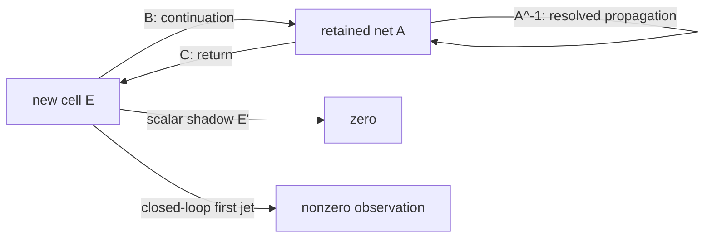

# The Schur first jet as an interaction net

The surprising source-prime-chain result has an exact interaction-net
explanation: the added cell is locally silent, but its continuation through the
retained net is observable.

Let the retained net have response \(A\), the new cell have response \(E\), and
the two typed incidence wires be \(B\) and \(C\). The local elimination rule is

\[
\operatorname{NEW}(E)
\mathbin{\Join}_{C,B}
\operatorname{RETAINED}(A)
\longrightarrow
\operatorname{EFFECTIVE}(E-CA^{-1}B).
\]

The term \(CA^{-1}B\) is the closed continuation residue. It leaves the new
cell, propagates through the retained net, and returns. Erasing that residue
replaces the effective cell by the observation-only shadow \(E\).

Differentiating the reduction produces four typed local redexes:

\[
S'=E'-C'A^{-1}B+CA^{-1}A'A^{-1}B-CA^{-1}B'.
\]

They are, respectively:

1. motion internal to the new cell;
2. motion of the entry incidence;
3. motion accumulated while traversing the retained net;
4. motion of the exit incidence.

For the first source-derived prime-chain extension, \(E'=0\) and \(B'=0\).
Nevertheless the entry-incidence and retained-transport redexes give a nonzero
effective jet. The terminal current is \(\operatorname{Tr}(S^{-1}S')\),
which exactly equals the determinant-frame increment. The diagonal shadow
\(\operatorname{Tr}(E^{-1}E')\) is zero.



This is the same explanatory pattern as the three-polarizer net. An isolated
readout does not contain the prediction. The prediction is carried by a typed
continuation that returns after interacting with another instrument.

The polarizer example needs an open path through an intermediate state, whereas
the determinant-frame example needs a closed return loop. Interaction nets
therefore recover both as different topologies of residue-preserving composition.

Verification:

```text
uv run --with sympy python research/aspect/checkers/check_schur_jet_interaction_net.py
```
