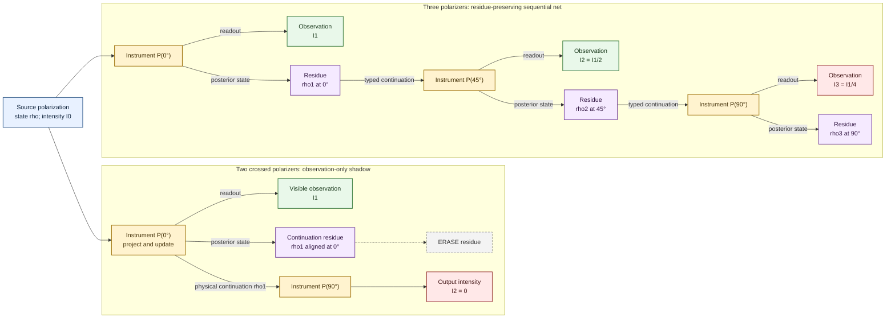

# Three-polarizer interaction net

This diagram models each polarizer as a state-changing instrument rather than a scalar intensity map. Its visible output is transmitted intensity; its continuation residue is the outgoing polarization state required by the next instrument.



## Local interaction rule

For ideal linear polarization at angle `phi`, a polarizer set to `theta` rewrites the incoming packet

```text
POLARIZER(theta) ⋈ STATE(I, phi)
    ->
OBSERVATION(I cos²(theta - phi))
+
RESIDUE(I cos²(theta - phi), theta)
```

The visible observation carries intensity. The residue carries the posterior polarization angle and transmitted intensity.

## Sequential reduction

For the three-filter path:

```text
STATE(I0, 0°)
  -> P(0°)
STATE(I0, 0°)
  -> P(45°)
STATE(I0/2, 45°)
  -> P(90°)
STATE(I0/4, 90°)
```

Hence the final intensity is

\[
I_3
=
I_0\cos^2(45^\circ)\cos^2(45^\circ)
=
\frac{I_0}{4}.
\]

For the crossed two-filter path:

\[
I_2
=
I_0\cos^2(90^\circ)
=
0.
\]

## Structural prediction

The middle polarizer does not reveal an intensity feature hidden in the first scalar observation. It changes the continuation residue from a \(0^\circ\) polarization state to a \(45^\circ\) state, creating a legal nonzero continuation through the final \(90^\circ\) polarizer.

Erasing the posterior-state residue makes sequential prediction impossible:

```text
observation-only shadow
=
intensity value
+
lost continuation constructor
```

The net therefore distinguishes:

- observation equivalence: equal visible intensity;
- instrument equivalence: equal readout, posterior state, residue, and legal continuations;
- sequential coherence: the output type and residue of one polarizer match the input type of the next.
