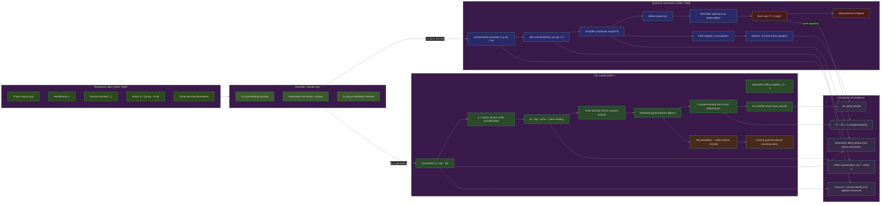

```mermaid
%%{
  init: {
    'theme': 'base',
    'themeVariables': {
      'fontSize': '14px',
      'lineColor': '#888',
      'primaryColor': '#2d5a27',
      'primaryTextColor': '#ddd',
      'primaryBorderColor': '#4a8',
      'secondaryColor': '#1a2a5a',
      'tertiaryColor': '#3a1a4a',
      'edgeLabelBackground': '#222'
    }
  }
}%%

flowchart LR
  subgraph Newton["Newtonian stem (1833−1925)"]
    N1["Phase space (q,p)"]
    N2["Hamiltonian H"]
    N3["Poisson bracket { , }"]
    N4["Action S = ∫(p dq − H dt)"]
    N5["Canonical transformations"]
  end

  subgraph HJ["Hamilton−Jacobi layer"]
    HJ1["S as generating function"]
    HJ2["Separation into action + phase"]
    HJ3["∮ p dq as adiabatic invariant"]
  end

  subgraph QM_path["Quantum mechanics (1925−1948)"]
    Q1["Quantization postulate: ∮ p dq = nℏ"]
    Q2["Non‑commutativity: pq−qp = iℏ"]
    Q3["Complex amplitude: exp(iS/ℏ)"]
    Q4["Hilbert space |ψ⟩"]
    Q5["Hermitian operators as observables"]
    Q6["Born rule: P = |⟨a|ψ⟩|²"]
    Q7["Measurement collapse"]
    Q8["Path integral: ∫𝒟q exp(iS/ℏ)"]
    Q9["Spinors: 4π from Dirac equation"]
  end

  subgraph Our_path["Our model (2025−)"]
    O1["Declared Clifford algebra, J² = −1"]
    O2["Connection α = dφ − β/κ"]
    O3["κ = action−phase scale (uncalibrated)"]
    O4["∫α = Δφ − ΔF/κ = clock reading"]
    O5["Finite discrete carrier (4‑point source)"]
    O6["Retained typed histories (fillers)"]
    O7["Complementarity from Gram determinant"]
    O8["4π minimal return from cocycle"]
    O9["No probability — deterministic records"]
    O10["Coarse‑grained rational counting ratios"]
  end

  subgraph Merge["Structural convergence"]
    M1["4π spinor period"]
    M2["V² + D² = 1 complementarity"]
    M3["Action quantization: ∮α = −area/κ"]
    M4["Geometric/ Berry phase from same connection"]
    M5["Cocycle = Jacobi identity (Lie algebra structure)"]
  end

  Newton --> HJ

  HJ -->|"∮ p dq is discrete"| Q1
  HJ -->|"∫α is geometric"| O2

  Q1 --> Q2 --> Q3 --> Q4 --> Q5 --> Q6 --> Q7
  Q3 --> Q8
  Q8 --> Q9

  O2 --> O3 --> O4 --> O5 --> O6 --> O7 --> O8
  O6 --> O9 --> O10

  Q9 --> M1
  O8 --> M1

  Q6 -->|"same equation"| M2
  O7 --> M2

  Q1 --> M3
  O4 --> M3

  Q3 --> M4
  O2 --> M4

  Q2 --> M5
  O2 --> M5

  style N1 fill:#2d4a1a,color:#ddd
  style N2 fill:#2d4a1a,color:#ddd
  style N3 fill:#2d4a1a,color:#ddd
  style N4 fill:#2d4a1a,color:#ddd
  style N5 fill:#2d4a1a,color:#ddd
  style HJ1 fill:#3a5a2a,color:#ddd
  style HJ2 fill:#3a5a2a,color:#ddd
  style HJ3 fill:#3a5a2a,color:#ddd

  style Q1 fill:#2a2a6a,color:#ddd
  style Q2 fill:#2a2a6a,color:#ddd
  style Q3 fill:#2a2a6a,color:#ddd
  style Q4 fill:#2a2a6a,color:#ddd
  style Q5 fill:#2a2a6a,color:#ddd
  style Q6 fill:#4a1a1a,color:#ddd
  style Q7 fill:#4a1a1a,color:#ddd
  style Q8 fill:#2a2a6a,color:#ddd
  style Q9 fill:#2a2a6a,color:#ddd

  style O1 fill:#2a4a2a,color:#ddd
  style O2 fill:#2a4a2a,color:#ddd
  style O3 fill:#2a4a2a,color:#ddd
  style O4 fill:#2a4a2a,color:#ddd
  style O5 fill:#2a4a2a,color:#ddd
  style O6 fill:#2a4a2a,color:#ddd
  style O7 fill:#2a4a2a,color:#ddd
  style O8 fill:#2a4a2a,color:#ddd
  style O9 fill:#4a2a1a,color:#ddd
  style O10 fill:#4a2a1a,color:#ddd

  style M1 fill:#3a2a4a,color:#ddd
  style M2 fill:#3a2a4a,color:#ddd
  style M3 fill:#3a2a4a,color:#ddd
  style M4 fill:#3a2a4a,color:#ddd
  style M5 fill:#3a2a4a,color:#ddd
```